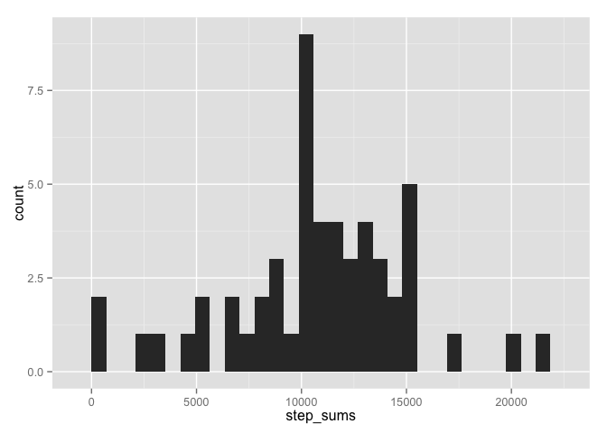
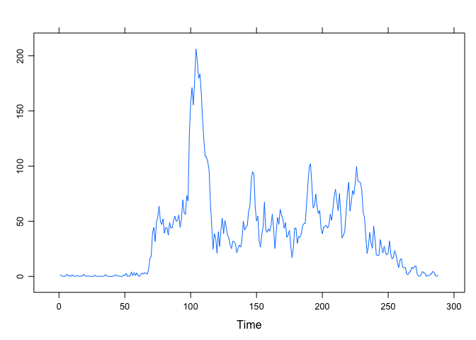

# Reproducible Research: Peer Assessment 1


## Loading and preprocessing the data


```r
activity_data <- read.csv("activity.csv")
```

## What is mean total number of steps taken per day?
### Step 1: Splitting the steps data into smaller vectors

The number of steps is measured in fixed intervals. Therefore, we have 288 observations daily. I use this information to create 61 smaller lists.


```r
steps_by_groups <- split(activity_data$steps, ceiling(seq_along(activity_data$steps)/288))
```

### Step 2: Calculating the sum in each smaller vector

I'm looping through each column and calculate the sum.


```r
step_sums <- sapply(steps_by_groups,sum)
```

### Step 3: Creating the histogram

I draw the histogram with ggplot2.


```r
library(ggplot2)
```

```
## Warning: package 'ggplot2' was built under R version 3.1.3
```

```r
qplot(step_sums, geom="histogram") 
```

 

### Step 4: Calculating the median and the mean of the number of steps

```r
steps_mean <- mean(step_sums, na.rm = TRUE)
steps_median <- median(step_sums, na.rm = TRUE)
```

The mean is 1.0766189\times 10^{4} and the median is 10765.

## What is the average daily activity pattern?

### Step 1 & 2: Time series plot and the maximum average measure.


```r
library(lattice)
```

```
## Warning: package 'lattice' was built under R version 3.1.3
```

```r
library(data.table)
```

```
## Warning: package 'data.table' was built under R version 3.1.3
```

```r
steps_sums_as_table <- data.frame(steps_by_groups)
average_steps_per_interval_across_days <- rowMeans(steps_sums_as_table, na.rm = TRUE)
ts_data <- ts(average_steps_per_interval_across_days, start = 1, end = 288)
xyplot(ts_data, type = "l")
```

 

```r
max_average_measure <- max(ts_data)
```

The highest number of steps are made on average in the 206.1698113th interval of the day. 

## Imputing missing values

### Step 1: Calculating the total number of missing values in the dataset.


```r
number_of_nas <- sum(is.na(activity_data))
```

There are 2304 NA values in the dataset.

### Step 2: Devising a strategy for filling in all the missing values in the dataset. 

The strategy is to replace all NAs with the average number of steps taken, averages across all days.

### Step 3: Creating a new dataset with the missing values filled in.


```r
DF <- matrix(steps_sums_as_table, nrow = 288, ncol = 61)
nas_replacer <- function(x,y) {
  for (i in x) {
    for (j in y) {
      if (is.na(DF[i,j])) DF[i,j] <- average_steps_per_interval_across_days[i]
    }
  }
}

tidy_data <- nas_replacer(1:288, 1:61)
```

### Step 4: Making a histogram with new results.

Oops I run out of time... And still gotta commit this file to Github!!
